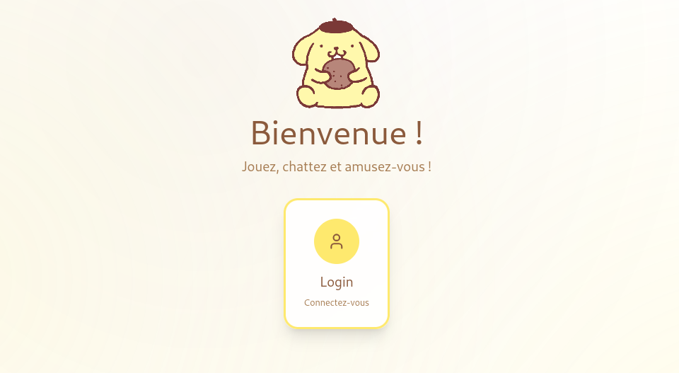

<h1 align="center">🏓 ft_transcendence 🏓</h1>

<p align="center">
  
</p>

---

<p align="center">
  
  <br/>
  🇬🇧 <a href="./README.en.md">English</a> • 
  🇫🇷 <a href="./README.md">Français</a>
</p>

---

<div align="center">
  
  <br/>
</div>
<details>
  <summary> 🌍 GitHubから</summary>

  ```bash
  git clone git@github.com:Mechard-Organization/Ft_transcendence.git

  ```
</details>

  <details>
    <summary> 🏫 Intraから</summary>

    ```bash
    git clone git@vogsphere.42paris.fr:vogsphere/intra-uuid-1b74ffcb-2a75-4cc1-a276-c47ee8672993-7191380-mechard

    ```
  </details>
</details>

---

<div align="center">
  
  <br/>
</div>

<p align="center"><a href="https://github.com/Mechard-Organization/Ft_transcendence/tree/jeanne"></a><a href="https://github.com/Mechard-Organization/Ft_transcendence/tree/lylou"></a><a href="https://github.com/Mechard-Organization/Ft_transcendence/tree/maxime"></a></p>

<p align="center"><a href="https://github.com/Mechard-Organization/Ft_transcendence/tree/medhi"></a><a href="https://github.com/Mechard-Organization/Ft_transcendence/tree/abdul"></a></p>
</br>

---

<p align="center">
  
</p>

**ft_transcendence** は、42 Common Core カリキュラムの最終プロジェクトとして開発されたフルスタックWebアプリケーションです。

本プロジェクトは、以下の機能で強化されたリアルタイム・マルチプレイヤーPongプラットフォームで構成されています：

セキュアな認証システム（JWT + OAuth 2.0 + 2要素認証）

WebSocketを使用したリアルタイム・マルチプレイヤーゲーム

ソーシャル機能（フレンド、チャット、プロフィール）

管理ツール

監視および可観測性スタック

HTTPSおよびリバースプロキシを使用した安全なインフラストラクチャ

本プロジェクトの目的は、最新のWeb技術、サイバーセキュリティの原則、DevOpsの実践、リアルタイムシステムを組み合わせた、本番環境レベルのWebアプリケーションを構築することでした。
</br>

---

<p align="center">
  
</p>

<details>
  <summary>
  
  ### 前提条件
  </summary>

  - Docker version >= 24
  - Docker Compose v2
  - Make
  - Node.js >= 18 (for local development)

</details>

<details>
  <summary>
  
  ### 環境変数
  </summary>

  ルートディレクトリに`.env`ファイルを作成してください：

  ```bash
  ###   GRAFANA   ###

  GF_SECURITY_ADMIN_USER=admin-grafana
  GF_SECURITY_ADMIN_PASSWORD=password-grafana
  GF_SERVER_HTTP_PORT=5000
  GF_INSTALL_PLUGINS=frser-sqlite-datasource

  ###   ADMIN   ###

  ADMIN=admin_username
  ADMIN_PASSWORD=strong_password
  ADMIN_MAIL=admin@example.com

  ### OAuth Google ###

  GOOGLE_CLIENT_ID=your_google_client_id
  GOOGLE_CLIENT_SECRET=your_google_client_secret
  GOOGLE_REDIRECT_URI=https://localhost/api/auth/google/callback
  OAUTH_SUCCESS_REDIRECT=path-redirection
  ```

</details>

<details>
  <summary>
  
  ### 🏥 コマンド一覧
  </summary>

  🚀 起動 :
  
  ```bash
  make

  ```
  または
  ```bash
  make start

  ```

  🛑 停止 :
  ```bash
  make down

  ```
  👼 完全に再ビルド:
  ```bash
  make rebirth

  ```
  📜 ログ :
  ```bash
  make logs

  ```
  **利用可能なmakeコマンドの完全な一覧**を表示するには、以下を実行してください：
  ```bash
  make help

  ```

</details>

<details>
  <summary>
  
  ### 🔓 アクセス
  </summary>

  メインアプリケーション（Nginx経由のHTTPS）：:

  https://localhost:8443

  利用可能なルート：

      Frontend: /

      API: /api/...

      WebSockets: /ws/

      Grafana: /grafana

      Prometheus: /prometheus

</details>

<p align="center">
  
</p>

<details>
  <summary>プロダクトオーナー + 開発者</summary>

    機能の定義および検証

    UI/UXの整合性管理

    フロントエンド実装

    ソーシャル機能の統合
</details>

<details>
  <summary>テクニカルリード + WebSockets</summary>

    バックエンドアーキテクチャ（Fastify）

    WebSocketサーバーの実装

    リアルタイム同期

    WebSocketリバースプロキシルーティング
</details>

<details>
  <summary>mel-yand — サイバーセキュリティ開発者</summary>

    2要素認証（TOTP）の実装

    OAuth 2.0（Google OpenID Connect）

    パスワード検証およびセキュリティポリシー

    入力検証およびセキュリティ強化
</details>

<details>
  <summary>ajamshid — ゲームロジック開発者</summary>

    Pongゲームプレイエンジン

    衝突システム

    スコアおよび試合状態管理

    試合履歴ロジック
</details>

<details>
  <summary>mechard — プロジェクトマネージャー + 開発者</summary>

      全体アーキテクチャの調整

      バックエンドAPI統合

      認証システム統合

      モニタリングスタック構築

      DevOpsオーケストレーション
</details>

<details>
  <summary>プロジェクト管理</summary>

    週次スプリント計画

    機能ベースのブランチ戦略

    必須レビュー付きPull Request

    全メンバーによる明確なコミット履歴

    タスク管理のためのGitHub Issues

    日常的なコミュニケーションのためのDiscord
</details>

**各メンバー**は、必須パートおよび選択モジュールの両方に貢献しました。

<details>
  <summary>🎨 フロントエンド</summary>

      React (Vite)

      TypeScript

      TailwindCSS

      Babylon.js （3Dレンダリング）

      Radix UI components
</details>

<details>
  <summary>💾 バックエンド</summary>

      Fastify (Node.jsフレームワーク)

      JWT authentication

      OAuth 2.0 / OpenID Connect (Google)

      TOTPベースの2要素認証

      WebSocketサーバー（リアルタイムゲームプレイ）
</details>

<details>
  <summary>💾 データベース</summary>

      SQLite (better-sqlite3)

  SQLiteを選択した理由：

      軽量

      高い信頼性

      コンテナとの容易な統合

      ユーザーおよびゲームロジックに十分なリレーショナル構造
</details>

<details>
  <summary>🏢 インフラストラクチャ</summary>

      Dockerコンテナ化

      Nginxリバースプロキシ

      HTTPSの完全強制

      Prometheusによるメトリクス収集

      Grafanaダッシュボード
</details>

<details>
  <summary>🗂️ データベーススキーマ</summary>
  Users

      id

      username

      password_hash

      mail

      google_sub

      oauth_enabled

      twofa_enabled

      twofa_secret

      admin

      avatarUrl

      created_at

  Match

      id

      player1_id

      player2_id

      score

      winner

      played_at

  Friends

      id_user

      id_friend

      id_sender

      accept

  Messages

      id

      id_author

      id_group

      content

      timestamp
</details>

リレーションにより、同時処理中でも**参照整合性を保証し、データ破損を防止します**。

<p align="center">
  
</p>

<details>
  <summary>認証</summary>

      セキュアなサインアップ／ログイン

      JWTベースのセッション管理

      強力なパスワード検証

      メール形式検証

      Google OAuth 2.0認証

      2要素認証の有効化／無効化

      2要素認証ログイン検証
</details>

<details>
  <summary>リアルタイム・マルチプレイヤーゲーム</summary>

      WebSocketベースの同期

      リモート1対1対戦

      再接続処理

      ライブ状態のブロードキャスト
</details>

<details>
  <summary>ソーシャルシステム</summary>

      プロフィールページ

      アバター管理

      フレンドシステム

      グループおよびプライベートチャット

      ユーザーのブロック
</details>

<details>
  <summary>管理機能</summary>

      理者ロール
</details>

<details>
  <summary>モニタリング</summary>

      Prometheusメトリクスエンドポイント

      Grafanaダッシュボード

      コンテナ化された可観測性
</details>

<p align="center">
  
</p>

<details>
  <summary>主要モジュール（各2ポイント）</summary>

    Web（Fastify + React フルスタックフレームワーク）

    リアルタイム機能（WebSockets）

    標準ユーザー管理

    サイバーセキュリティ（OAuth 2.0 + 2要素認証）

    ゲーム（完全なWebベースゲーム）

    DevOps（モニタリング + コンテナ化）
</details>

<details>
  <summary>副次モジュール（各1ポイント）</summary>

    構造化DBレイヤーによるORM代替アプローチ

    試合履歴および統計

    高度なチャット機能
</details>

個人の貢献：

<details>
  <summary>jealefev</summary>

      プロダクト検証

      フロントエンドUI

      ソーシャル機能
</details>

<details>
  <summary>abutet</summary>

      Fastifyサーバーアーキテクチャ

      WebSocket実装

      リバースプロキシ設定
</details>

<details>
  <summary>mel-yand</summary>

      2要素認証実装

      Google OAuth統合

      セキュリティ検証ロジック
</details>

<details>
  <summary>ajamshid</summary>

      ゲームエンジンロジック

      衝突検出

      スコア管理
</details>

<details>
  <summary>mechard</summary>

      認証統合

      JWTフロー

      モニタリングスタック

      Dockerオーケストレーション
</details>

すべてのモジュールは**動作可能で実証可能です**。

合計：**14点以上**

---

すべての技術実装は、チームによって作成、レビュー、および検証されました。

ライセンス

    42で開発された教育用プロジェクトです。

---

<p align="right">作成<i><b>mechard</b></i></p>