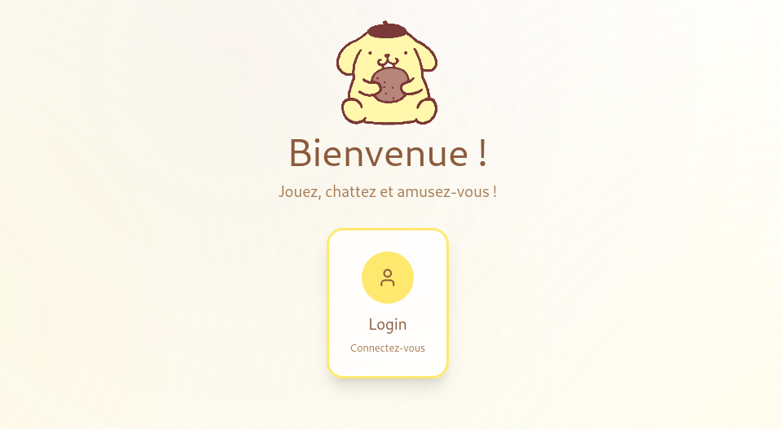
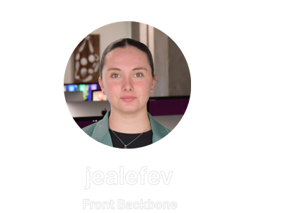
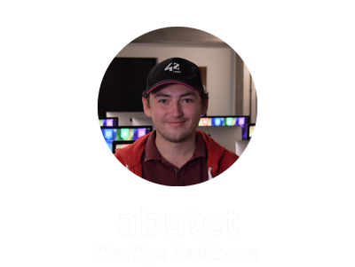

<h1 align="center">🏓 ft_transcendence 🏓</h1>

<p align="center">
  🌐 <a href="https://ft-transcendence-42.app/">Voir la démo en ligne</a>
</p>

<p align="center">
  
</p>

---

<p align="center">
  
  <br/>
  🇯🇵 <a href="./README.jp.md">日本語</a> • 
  🇬🇧 <a href="./README.en.md">English</a>
</p>

---

<div align="center">
  
  <br/>
</div>
<details>
  <summary> 🌍 Depuis GitHub</summary>

  ```bash
  git clone git@github.com:Mechard-Organization/Ft_transcendence.git

  ```
</details>

  <details>
    <summary> 🏫 Depuis Intra</summary>

    ```bash
    git clone git@vogsphere.42paris.fr:vogsphere/intra-uuid-1b74ffcb-2a75-4cc1-a276-c47ee8672993-7191380-mechard

    ```
  </details>
</details>

---

<div align="center">
  
  <br/>
</div>

<p align="center"><a href="https://github.com/Mechard-Organization/Ft_transcendence/tree/jeanne"></a><a href="https://github.com/Mechard-Organization/Ft_transcendence/tree/lylou"></a><a href="https://github.com/Mechard-Organization/Ft_transcendence/tree/maxime"></a></p>

<p align="center"><a href="https://github.com/Mechard-Organization/Ft_transcendence/tree/medhi"></a><a href="https://github.com/Mechard-Organization/Ft_transcendence/tree/abdul"></a></p>
</br>

---

<p align="center">
  
</p>

**ft_transcendence** est une application web full-stack développée comme projet final du tronc commun (Common Core) de l’école 42.

Le projet consiste en une plateforme Pong multijoueur en temps réel enrichie avec :

Un système d’authentification sécurisé (JWT + OAuth 2.0 + 2FA)

Un jeu multijoueur en temps réel utilisant WebSockets

Des fonctionnalités sociales (amis, chat, profils)

Des outils d’administration

Une stack de monitoring et d’observabilité

Une infrastructure sécurisée utilisant HTTPS et un reverse proxy

L’objectif était de construire une application web prête pour la production, combinant des technologies web modernes, des principes de cybersécurité, des pratiques DevOps et des systèmes temps réel.
</br>

---

<p align="center">
  
</p>

<details>
  <summary>
  
  ### Prérequis
  </summary>

  - Docker version >= 24
  - Docker Compose v2
  - Make
  - Node.js >= 18 (for local development)

</details>

<details>
  <summary>
  
  ### Variables d’environnement
  </summary>

  Créez un fichier `.env` à la racine avec :

  ```bash
  ###   GRAFANA   ###

  GF_SECURITY_ADMIN_USER=admin-grafana
  GF_SECURITY_ADMIN_PASSWORD=password-grafana
  GF_SERVER_HTTP_PORT=5000
  GF_INSTALL_PLUGINS=frser-sqlite-datasource

  ###   ADMIN   ###

  ADMIN=admin_username
  ADMIN_PASSWORD=strong_password
  ADMIN_MAIL=admin@example.com

  ### OAuth Google ###

  GOOGLE_CLIENT_ID=your_google_client_id
  GOOGLE_CLIENT_SECRET=your_google_client_secret
  GOOGLE_REDIRECT_URI=https://localhost/api/auth/google/callback
  OAUTH_SUCCESS_REDIRECT=path-redirection
  ```

</details>

<details>
  <summary>
  
  ### 🏥 Liste des commandes
  </summary>

  🚀 Lancer :
  
  ```bash
  make

  ```
  ou
  ```bash
  make start

  ```

  🛑 Arrêter :
  ```bash
  make down

  ```
  👼 Reconstruire complètement:
  ```bash
  make rebirth

  ```
  📜 Logs :
  ```bash
  make logs

  ```
 Pour une **liste complète des commandes make disponibles**, exécutez :
  ```bash
  make help

  ```

</details>

<details>
  <summary>
  
  ### 🔓 Accès
  </summary>

  Application principale (HTTPS via Nginx) :

  https://localhost:8443

  Routes disponibles :

      Frontend: /

      API: /api/...

      WebSockets: /ws/

      Grafana: /grafana

      Prometheus: /prometheus

</details>

<p align="center">
  
</p>

<details>
  <summary>jealefev — Product Owner + Développeuse</summary>

    Définition et validation des fonctionnalités

    Cohérence UI/UX

    Implémentation frontend

    Intégration des fonctionnalités sociales
</details>

<details>
  <summary>abutet — Responsable technique + WebSockets</summary>

    Architecture backend (Fastify)

    Implémentation du serveur WebSocket

    Synchronisation en temps réel

    Routage WebSocket via reverse proxy
</details>

<details>
  <summary>mel-yand — Développeur cybersécurité</summary>

    Implémentation de la 2FA (TOTP)

    OAuth 2.0 (Google OpenID Connect)

    Validation des mots de passe et politiques de sécurité

    Validation des entrées et renforcement de la sécurité
</details>

<details>
  <summary>ajamshid — Développeur logique du jeu</summary>

    Moteur de gameplay Pong

    Système de collision

    Gestion des scores et de l’état des parties

    Logique de l’historique des matchs
</details>

<details>
  <summary>mechard — Chef de projet + Développeur</summary>

      Coordination de l’architecture globale

      Intégration de l’API backend

      Intégration du système d’authentification

      Mise en place du monitoring

      Orchestration DevOps
</details>

<details>
  <summary>Gestion de projet</summary>

    Planification de sprint hebdomadaire

    Stratégie de branches basée sur les fonctionnalités

    Pull Requests avec revue obligatoire

    Historique de commits clair pour tous les membres

    GitHub Issues pour le suivi des tâches

    Discord pour la communication quotidienne
</details>

**Chaque membre** a contribué à la fois à la partie obligatoire et aux modules sélectionnés.

<details>
  <summary>🎨 Frontend</summary>

      React (Vite)

      TypeScript

      TailwindCSS

      Babylon.js (3D rendering)

      Radix UI components
</details>

<details>
  <summary>💾 Backend</summary>

      Fastify (framework Node.js)

      JWT authentication

      OAuth 2.0 / OpenID Connect (Google)

      TOTP-based 2FA

      WebSocket server (jeu en temps réel)
</details>

<details>
  <summary>💾 Base de données</summary>

      SQLite (better-sqlite3)

  Pourquoi SQLite ?

      Léger

      Fiable

      Intégration facile dans les conteneurs

      Structure relationnelle suffisante pour la logique utilisateur et jeu
</details>

<details>
  <summary>🏢 Infrastructure</summary>

      Conteneurisation Docker

      Reverse proxy Nginx

      HTTPS forcé partout

      Collecte des métriques avec Prometheus

      Tableaux de bord Grafana
</details>

<details>
  <summary>🗂️ Database Schema</summary>
  Users

      id

      username

      password_hash

      mail

      google_sub

      oauth_enabled

      twofa_enabled

      twofa_secret

      admin

      avatarUrl

      created_at

  Match

      id

      player1_id

      player2_id

      score

      winner

      played_at

  Friends

      id_user

      id_friend

      id_sender

      accept

  Messages

      id

      id_author

      id_group

      content

      timestamp
</details>

Les relations assurent l’**intégrité référentielle et empêchent la corruption des données** lors d’actions concurrentes.

<p align="center">
  
</p>

<details>
  <summary>Authentication</summary>

      Inscription et connexion sécurisées

      Gestion de session basée sur JWT

      Validation forte des mots de passe

      Validation du format email

      Authentification Google OAuth 2.0

      Activation/désactivation de la 2FA

      Vérification de connexion avec 2FA
</details>

<details>
  <summary>Jeu multijoueur en temps réel</summary>

      Synchronisation via WebSockets

      Gameplay 1v1 à distance

      Gestion de la reconnexion

      Diffusion de l’état en temps réel
</details>

<details>
  <summary>Système social</summary>

      Pages de profil

      Gestion des avatars

      Système d’amis

      Chat privé et de groupe

      Blocage des utilisateurs
</details>

<details>
  <summary>Administration</summary>

      Rôle administrateur

</details>

<details>
  <summary>Monitoring</summary>

      Endpoint de métriques Prometheus

      Tableaux de bord Grafana

      Observabilité conteneurisée
</details>

<p align="center">
  
</p>

<details>
  <summary>Modules majeurs (2 points chacun)</summary>

    Web (framework full-stack Fastify + React)

    Fonctionnalités temps réel (WebSockets)

    Permettre aux utilisateurs d'intéragir entre eux

    API public

    Gestion standard des utilisateurs

    Opposant IA

    Jeu (jeu web complet)

    DevOps (monitoring + conteneurisation)
</details>

<details>
  <summary>Modules mineurs (1 point chacun)</summary> 

    Design du site personalisé

    Approche alternative à ORM avec couche DB structurée

    Historique des matchs et statistiques

    Cybersécurité (OAuth 2.0)

    Cybersécurité (2FA)

    Fonctionnalités de chat avancées
</details>

Contributions individuelles:

<details>
  <summary>jealefev</summary>

      Validation produit

      UI frontend

      Fonctionnalités sociales
</details>

<details>
  <summary>abutet</summary>

      Architecture serveur Fastify

      Implémentation WebSocket

      Configuration reverse proxy
</details>

<details>
  <summary>mel-yand</summary>

      Implémentation 2FA

      Intégration OAuth Google

      Logique de validation de sécurité
</details>

<details>
  <summary>ajamshid</summary>

      Logique du moteur de jeu

      Détection de collision

      Gestion des scores
</details>

<details>
  <summary>mechard</summary>

      Intégration de l’authentification

      Flux JWT

      Stack de monitoring

      Orchestration Docker
</details>

Tous les modules sont **fonctionnels et démontrables**.

Total : **22 points**

---

Toutes les implémentations techniques ont été écrites, relues et validées par l’équipe.

Licence

    Projet éducatif développé à 42.

---

<p align="right">écrit par <i><b>mechard</b></i></p>
